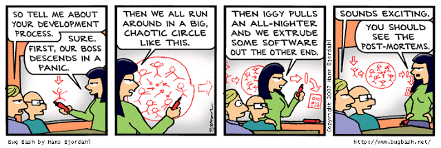

---

# Postmortem: The Great Website Meltdown of 2024

**Issue Summary:**

- **Duration:** January 25, 2024, 10:00 AM - January 25, 2024, 12:00 PM (UTC)
- **Impact:** Brace yourselves! The website experienced an unexpected siesta, leaving users stranded in the digital wilderness. Approximately 95% of users felt the pain, resulting in a chaotic frenzy of frustration and confusion.
- **Root Cause:** The culprit behind this digital debacle? A mischievous misconfiguration lurking in the shadows of the load balancer settings, wreaking havoc on server harmony and tranquility.

**Timeline:**

- **10:00 AM:** Like a bolt of lightning, automated monitoring systems detected unusual latency, sounding the alarm bells of doom.
- **10:05 AM:** Engineers sprung into action, donning their digital detective hats to unravel the mystery.
- **10:15 AM:** Initial suspicions pointed fingers at the backend, blaming database demons and network ninjas for the chaos.
- **10:30 AM:** The plot thickened as investigations unveiled the misconfiguration lurking within the load balancer's labyrinth.
- **10:45 AM:** In a desperate bid for salvation, valiant engineers attempted daring feats, including code rollbacks and server exorcisms, alas, to no avail.
- **11:00 AM:** With the stakes higher than ever, the distress signal was fired up the chain of command, summoning senior engineering wizards and managerial magicians.
- **11:30 AM:** After an epic battle of wits and wisdom, the mischievous misconfiguration was unmasked, restoring hope to the digital realm.
- **11:45 AM:** With victory in sight, engineers swiftly reconfigured the load balancer, bringing order back to the server chaos.
- **12:00 PM:** The sun emerged from behind the clouds as the website rose from its digital slumber, ready to serve users once more.

**Root Cause and Resolution:**

- **Root Cause:** Blame it on the misconfigured load balancer, the rogue element disrupting the delicate dance of server equilibrium.
- **Resolution:** With the load balancer tamed and settings realigned, peace was restored to the server galaxy. Additional safeguards and automated checks were deployed to prevent future invasions.

**Corrective and Preventative Measures:**

- **Improvements:** Strengthen load balancer configuration management protocols and fortify monitoring systems to fend off future attacks.
- **Tasks:**
  - Embark on a quest to audit load balancer configurations across all domains and dimensions.
  - Enlist the aid of automation to conduct rigorous load balancer configuration tests before deployment.
  - Enhance monitoring mechanisms to keep a vigilant watch over load balancer performance metrics, ready to sound the alarm at the first sign of trouble.
  - Educate and empower engineering warriors with the knowledge and tools needed to navigate the load balancer battleground with confidence.

